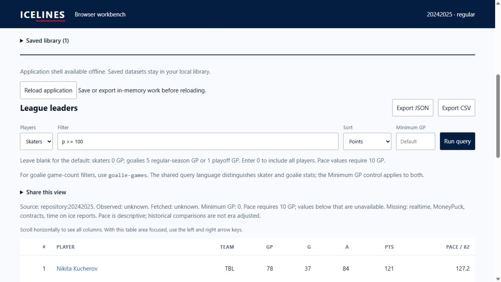

# Browser WASM pulse 28 — installer-tab update correction

Date: 2026-10-04. REQ-BROWSER-001 / WP-BW-06. Previous turn made verified
progress on offline reopening. Goal remains active.

An actual two-tab update rehearsal exposed a lifecycle defect. The tab that
first registered the shell captured `hadController=false` permanently. Initial
claim correctly preserved its in-memory work, but every later controller
replacement also skipped reload. A later-opened tab reloaded correctly while
the original tab retained its old UI and update notice. This could mix an old
UI with the newly activated asset cache.

`src/offline.ts` now records the first controller claim. It leaves initial work
intact, reloads on subsequent replacement and guards duplicate reloads. A new
regression failed against the old module (zero reloads instead of one); both
initially controlled and initially uncontrolled cases now pass. Existing
cross-tab consent remains required.

## Verification

`npm test` passed 121 tests, zero failures; log:
`target/browser-pulse-28-tests.txt`. The actual-distribution verifier loaded and
queried all 75 packages with WASM, checked 21 shell assets and four hand goldens.
Largest application plus single-package gzip sum: 399,744 bytes.

Current shell build:
`c51a89c39120ec3513e9985af2086aed81e2cdc2d274213c946f44a8dec76b05`.
Generated `sw.js` SHA-256:
`03f3c77e1d1bb9a89e09eacfd71a68744ad635b11305d825fecba27928d86552`.
The manifest's `worker_sha256` identifies the template, not generated sw.js.

Fresh installation used the real composed app at
`http://127.0.0.1:8064/ICELINES/workbench/`, with 95 baseline documentation files
preserved and 101 browser files staged. Saved the actual 2024–25 regular package
and ran `p >= 100` (six rows). Opened a second controlled tab. Served the exact
retained pulse-27 browser bytes at the same path, then updated forward to the
current build. For each replacement, consent in only one tab waited for the
other; both tabs reloaded after the second consent and restored all 905 saved
skaters. The original installer tab now reloaded too, clearing its private
filter as expected under the default bookmark policy.

The local Python server initially returned 304 for the older worker because
copying retained its older filesystem modification time. Updating only its
modification time allowed discovery; byte hashes were unchanged. This is a
local HTTP harness adjustment, not a production update mechanism.

Stopped server session 11920 (Ctrl+C, exit 1) and independently confirmed HTTP
connection refusal. The current build reopened offline, restored 905 saved
skaters, and ran a new `p >= 100` query with six rows, led by Kucherov's 121 points.

## Limits and remaining work

These two builds share storage schema 2; this proves selected same-schema saved
season compatibility and local controller/update behavior. It does not prove
schema migration in a real browser, saved schedule compatibility, all browsers,
or remotely retained clean-artifact rollback. The earlier defective installer
tab needs a manual application reload to acquire corrected tracking; the fix
cannot retroactively change JavaScript already running there.

Pages deployment/source migration, exact HTTPS live access, representative
mobile/resource coverage and remote rollback remain open. Relay hosting remains
deferred until deployed-origin testing. No remote publication/settings changed.
