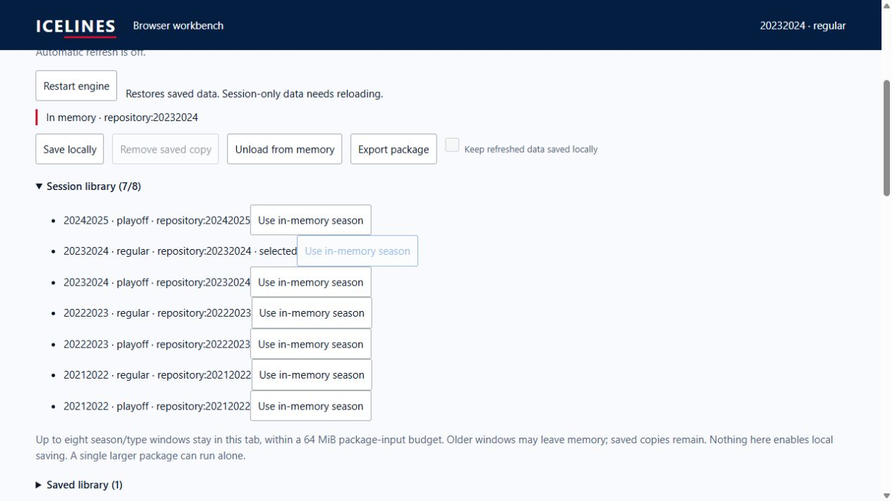

# Browser WASM pulse 30 — bounded session residency

Date: 2026-10-04. REQ-BROWSER-001 / WP-BW-02/03/05. Previous turn verified
real library migration. Goal remains active.

The engine retained one prepared season despite the plan's eight-window
requirement. Added Rust-owned LRU residency for eight season/type windows, one
revision per context, with a 64 MiB aggregate package-input budget. A larger
validated active package runs alone. Normalization completes before replacement;
invalid input preserves data and recency. Exact-revision selection reuses the
prepared repository; evicted revisions are refused without changing selection.
Unload releases only the selected window. Missing game-log/career inputs remain
refused; this does not add multi-season query surfaces.

Worker load returns revision/resident revisions atomically. The UI retains
matching package snapshots for save/export, removes evicted snapshots, and
exposes a Session library. Catalog selection reuses an exact resident revision.
Worker failure/restart clears residency. Residency never enables local saving.

## Verification

Four new Rust tests cover eviction/recency, validated replacement and type
separation, unload independence and input-budget accounting. All 12 WASM-crate
tests passed. Full checked build passed: 270 native/distributed-WASM parity
cases (33,613 rows), affected Rust suites, Python checks and 121 browser tests
(`target/browser-pulse-30-build.txt`). After the final atomic load response and
UI wording changes, rebuilt and reran all 121 browser tests and the distribution
verifier, including actual-WASM eight-window eviction/select/unload checks.
Final test log: `target/browser-pulse-30-tests-final.txt`. WASM-crate clippy with
all targets and warnings denied passed. Final application plus largest package:
403,555 gzip bytes. Shell build:
`32a7b444dd7659ea52d03bf27147a0849d2528917a6b768ede84233550da5279`.

Actual UI: `http://127.0.0.1:8066/ICELINES/workbench/`. Loaded nine real windows.
The oldest (2025–26 regular) left memory after the ninth load; its explicitly
saved copy remained. Saved count stayed one throughout eight further loads;
session count stopped at eight. Stopped server session 59980 (Ctrl+C, exit 1),
then independently confirmed connection refusal. Selected cached 2024–25
regular: `p >= 100` returned six rows, led by Kucherov's 121 points. Unloading
it left seven windows and the saved copy. Selected cached 2023–24 regular:
the same filter returned nine rows, led by Kucherov's 144 points.

## Measurements and remaining gates

The updated production-worker benchmark loaded all 75 packages and ran 1,500
warm queries, reaching eight resident windows. Instrumented startup: 109.1 ms.
Worst per-package warm round-trip p95: 3.0 ms. Peak allocated WASM linear memory:
25,034,752 bytes (23.88 MiB). Sampled main-page JS heap maximum: 55,270,849 bytes.
[Raw report](browser-pulse-30-benchmark.json) records build/user agent and every
package measurement. Linear memory and sampled heap exclude browser/native/
worker-JS overhead and can miss staging peaks; adding them cannot prove the
250 MiB full desktop peak gate. Query timing excludes table rendering.

Archive staging, large-library stress, representative mobile resources, broader
lifecycle/device coverage, Pages deployment/source migration, exact HTTPS live
access and remote clean-artifact rollback remain open. Relay hosting remains
deferred until deployed-origin testing. No remote mutation ran.
