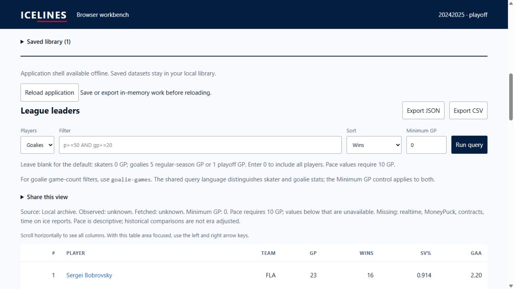

# Browser WASM pulse 31 — actual playoff archive import and conversion cost

Date: 2026-10-04. REQ-BROWSER-001 / WP-BW-03 / WP-BW-05. Previous turn
implemented and verified bounded residency. Goal remains active.

Rechecked the downloaded real data-20242025 GitHub release archive. Its 149,672
bytes still match the published SHA-256:
`23ab90d4306c18299ac68d35389bc75edea5ce454765c40b6c66c6248b34d8ca`.
This is the pulse-04 release input; no new live download was needed.

## Actual file-picker evidence

The actual production UI at `http://127.0.0.1:8066/ICELINES/workbench/` used
the current shell build
`32a7b444dd7659ea52d03bf27147a0849d2528917a6b768ede84233550da5279`.
Selected playoff conversion and imported the real archive through the browser
file chooser. Its tool call took about 657 seconds to return despite the shorter
requested timeout. That elapsed time is not an archive-conversion measurement.
The exact-label locator did not match the archive-type select; its observed DOM
ID was used instead. No production markup was changed to address tool matching.

Import completed as **In memory · Local archive**, 2024–25 playoffs. All 332
skaters were projected through WASM, led by Draisaitl and McDavid with 33 points
each. The goalie query with explicit minimum GP 0 returned all 27 goalies, led
by Bobrovsky with 16 wins. Observation/fetch timestamps stayed unknown and
missing optional sources remained disclosed. The saved count stayed one; the
import did not save automatically. The file input was cleared after import.

This closes the selected direct playoff-picker observation left open in pulse
04. Repeated archive conversion is measured below, but repeated same-file
picker interaction was not performed this turn.

## Browser conversion measurements

Added `scripts/prepare-browser-release-benchmark-preview.mjs`. It verifies the
real archive digest before copying public input into a disposable local harness,
keeps production modules/WASM unchanged, and runs the production EngineClient/
worker import and load operations. A wrapper reports response timing and WASM
linear memory. Each sample checks digest, season/type, actual skater/goalie
counts and shared-query projections. It terminates its worker after completion.
No controls or release archive are added to the publishable distribution.

Actual local browser at `http://127.0.0.1:8068/release-benchmark.html` completed
six regular and six playoff conversions/loads, with no saves or live calls.

| Measurement | Result |
|---|---|
| Compressed archive | 149,672 bytes |
| Expanded tar, including headers/padding | 1,177,600 bytes |
| Largest regular conversion round trip | 12.0 ms |
| Largest playoff conversion round trip | 7.0 ms |
| Initial regular package load | 20.7 ms |
| Initial playoff package load | 4.4 ms |
| Peak allocated WASM linear memory | 6,422,528 bytes (6.13 MiB) |
| Regular query counts | 905 skaters / 103 goalies |
| Playoff query counts | 332 skaters / 27 goalies |

Later exact-revision loads can reuse resident normalized repositories; these
are not all cold normalization timings. Round trips include worker transport,
validation and conversion; they exclude file-picker latency and table rendering.
Linear memory excludes archive-worker JavaScript, browser overhead and transient
staging peaks, so it cannot prove the full 250 MiB peak-memory gate.

[Raw measurements](browser-pulse-31-release-benchmark.json) record all samples,
build identity and browser user agent. Preparation-script syntax check passed.
Production source was unchanged; the prior 121-test result remains pulse-30
evidence, not a new run claimed here.

## Remaining gates

This is one actual regular/playoff release archive, not every release layout or
maximum allowed compressed/expanded input. Adversarial archive limits retain
fixture evidence. Representative mobile resources, full browser peak memory,
broader lifecycle/device coverage, Pages deployment/source migration, exact
HTTPS live access and remote clean-artifact rollback remain open. Relay hosting
stays deferred until deployed-origin testing. No remote mutation ran.
