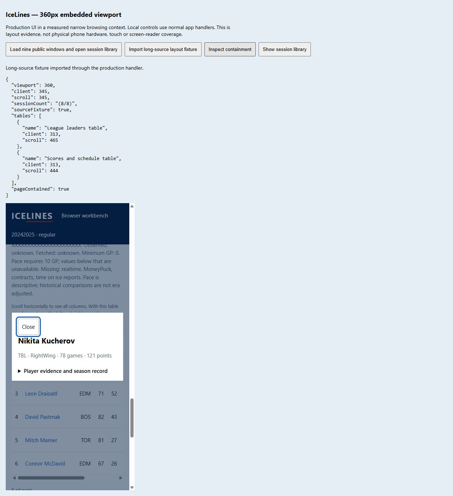

# Browser WASM pulse 32 — session-library containment and narrow keyboard flow

Date: 2026-10-04. REQ-BROWSER-001 / WP-BW-05. Goal remains active.

Added a disposable local layout harness in
`scripts/prepare-browser-session-layout-preview.mjs`. It copies production assets
unchanged into a measured 360 × 800 iframe. Visible fixture controls invoke normal
catalog/import handlers. Nine public windows exercise the eight-window session
library; a real regular-season package with a synthetic 512-character unbroken
source suffix exercises wrapping. This is synthetic import-handler evidence,
not a file-picker or physical-phone test. No fixture controls enter the published
distribution.

Before correction, the document had a 345px client width and 4,586px scroll width.
The session list lacked the wrapping rules already used by the saved library.
Added flexible rows and `overflow-wrap:anywhere` to its source labels in
`icelines-browser/style.css`. On a fresh origin with the rebuilt shell, the same
eight-window/long-source scenario measured 345px client and scroll widths. The
leaders and schedule tables retain their own horizontal scrolling (313/465px
and 313/444px respectively). See [raw measurements](browser-pulse-32-layout.json).

The browser viewport override accepted dimensions but did not actually resize
the host page; it was reset. All narrow-layout claims use the measured iframe.
The original faulty screenshot crop showed parent controls and was replaced by
a verified full-page capture containing the report and the narrow application.

Frame keyboard interaction succeeded: ArrowRight moved the named leaders region
to scrollLeft 40; ArrowLeft returned to zero. Tab reached Nikita Kucherov, Enter
opened the named dialog with focus on Close, and Escape closed it and restored
focus to the player. The capture reopens the dialog to show its focused Close.
This supersedes the selected iframe-keyboard tool limitation in pulse 18; it
does not establish all accessibility behavior or screen-reader compatibility.

`npm test` rebuilt the distribution and passed all 121 tests. Distribution
verification passed 21 shell assets, 75 packages, four count goldens and actual
WASM residency checks. App plus largest package gzip is 403,584 bytes. Current
shell build is
`6067e95c6a393e7acf567703b1d8520b14a12060b408c5649dc0d55c304c7056`.
No Rust/domain behavior changed in this pulse.

Physical mobile/touch testing, complete peak-memory accounting, deployed Pages
live access and remote rollback remain open. Per the user's decision, relay
hosting and operating ownership will be chosen after deployed-origin testing.
No remote publication or settings change ran.
