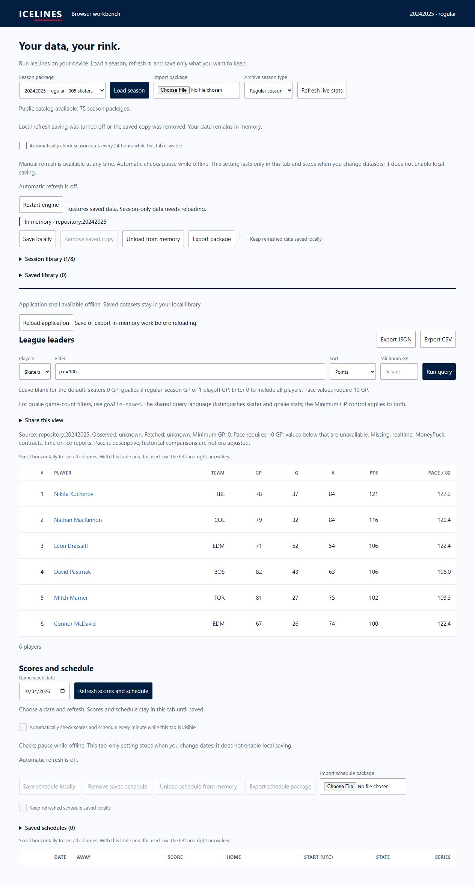

# Browser WASM pulse 33 — revoke refresh-save consent across tabs

Date: 2026-10-04. REQ-BROWSER-001 / WP-BW-03 / WP-BW-04. Previous turn
made verified layout progress. Goal remains active.

Audit found that season-library notifications refreshed saved headers but left
resident `keepUpdated` policy unchanged. Removing a saved context in another
tab could therefore leave that tab willing to save a later refresh. Schedule
reconciliation handled deletion but missed a same-revision policy revocation.

Added shared browser-policy reconciliation: a verified library listing can
revoke consent when a context is removed or its policy disabled. It cannot
grant saving consent to a session-only tab. All resident season windows are
reconciled, and schedule snapshots use the same rule. Bytes, queries and
selection remain in memory. A visible status explains revocation, replacing
the obsolete “refreshes will update your saved copy” message. Season library
reads now discard obsolete asynchronous listings, as schedules already did.
This changes browser persistence policy only; Rust/domain formulas are unchanged.

Added three regressions. One uses real fixture IndexedDB and a delayed schedule
acquisition: another actor disables saving on the same saved revision while
refresh is pending; completion produces fresh session data while preserving the
original saved bytes/revision and disabled policy. The other two cover removal/
revocation and preventing a library notification from granting consent.
`npm test` rebuilt and passed all **124** tests. Distribution verification passed
22 shell assets, 75 actual WASM packages, four count goldens and residency checks.
App plus largest package gzip: **404,124 bytes**. Current shell build:
`a53c4d6746f98cdbccad6c345841aa61bbf61a303de1681e47a561ff3ae64300`.

Actual final-build browser evidence used two tabs on fresh local origin
`http://127.0.0.1:8072/ICELINES/workbench/`, with unchanged production assets.
Tab A loaded/saved 2024–25 regular and explicitly enabled refresh saving. Tab B
restored its saved copy and disabled the policy. Tab A received the notification,
cleared its checkbox and displayed the revocation message. Re-enabling it in A
did not grant consent to B. B removed the saved copy; A showed zero saved
records, an unchecked/disabled refresh-save checkbox and **In memory**. A new
`p>=100` WASM query still returned six players. No live upstream refresh ran.
The delayed refresh/save behavior is fixture evidence, not a deployed live claim.

Remaining gates include broader conflict/storage-loss/browser coverage, physical
mobile and full peak memory, deployed Pages/live acquisition and remote rollback.
Relay hosting stays deferred until deployed-origin testing. No remote mutation ran.
