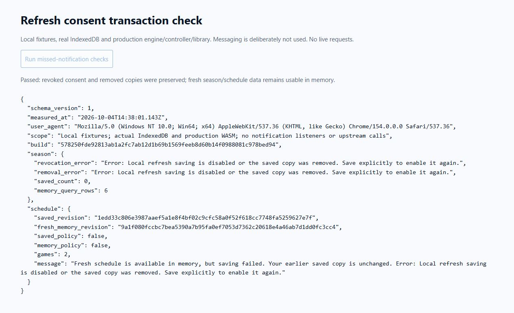

# Browser WASM pulse 34 — transaction-level refresh consent

Date: 2026-10-04. REQ-BROWSER-001 / WP-BW-03 / WP-BW-04. Previous turn
made verified policy progress. Goal remains active.

The pulse-33 notification fix did not cover lost/delayed messaging. Package
digests do not change when saved refresh consent changes, so revision-only
compare-and-swap could overwrite revoked consent with a subsequent refresh.
Two new regressions failed on the previous implementation: the season refresh
save was not rejected, and the schedule's old saved revision was replaced.
See local `target/browser-pulse-34-red-tests.txt` (124 passing, two failing).

Season and schedule refresh saves now request `requireRefreshConsent`. The same
serialized IndexedDB transaction that writes blobs/headers/active pointers
checks that the existing record and refreshed snapshot both have consent. A
missing record or disabled policy aborts before any write, even when expected
revision is null or unchanged. Explicit user saves retain their existing
behavior. Stats save failure also reloads verified headers to reconcile policy.
Schedule failure retains its failure explanation when reconciliation revokes
the memory policy. Rust/domain behavior and the storage schema are unchanged.

`npm test` rebuilt the distribution and passed **126** tests. Distribution
verification passed 22 assets, 75 actual WASM packages, four count goldens and
eight-window residency checks. App plus largest package gzip: **404,356 bytes**.
Final shell build:
`578250fde92813ab1a2fc7ab12d1b69b1569feeb8d60b14f0988081c978bed94`.

Added disposable `scripts/prepare-browser-consent-preview.mjs`, copying production
modules/WASM unchanged with separate visible test controls and a schedule fixture.
Actual browser `http://127.0.0.1:8073/consent.html` used real IndexedDB, the
production library/controller and shared WASM. No library notification listeners
were registered. A real catalog season was loaded into WASM; same-revision
revocation refused a guarded save. After removal, a guarded save with null
expected revision was refused and zero records/no active pointer remained.
A fresh memory query returned six players. A pending schedule refresh completed
after consent was revoked: two games remained projected, fresh memory revision
changed, original saved revision remained and both policies were false.

[Raw browser report](browser-pulse-34-consent.json) records identity and exact
errors/revisions. The harness invokes guarded season writes directly; schedule
refresh runs through the production controller. This is actual browser storage
and fixture acquisition evidence, not upstream/deployed-origin live proof.
Fixture controls and data are excluded from the publishable distribution.

Remaining gates: broader conflict/storage-loss/device coverage, physical mobile
and full peak memory, Pages deployment/live access and remote rollback. Relay
hosting stays deferred until deployed-origin testing. No remote mutation ran.
