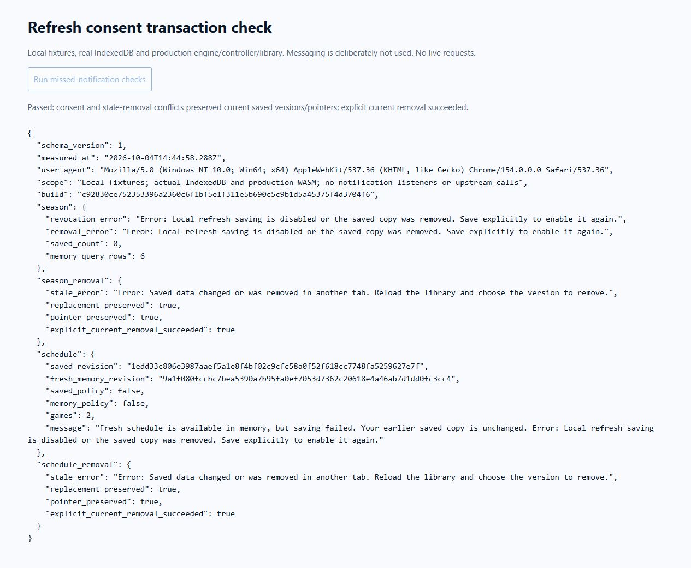

# Browser WASM pulse 35 — revision-checked saved-copy removal

Date: 2026-10-04. REQ-BROWSER-001 / WP-BW-03. Previous turn made verified
transaction-consent progress. Goal remains active.

Removal lacked the revision check used by save/load. A stale listing could
delete another actor's replacement under the same ID. New season/schedule
regressions both failed with missing rejection on the prior implementation
(`target/browser-pulse-35-red-tests.txt`: 126 pass, two fail).

Removal now requires the selected saved revision. In one read/write transaction
it checks the record before deleting either the record or active pointer.
Replaced/missing revisions abort with a reload-and-select recovery message.
Season/schedule controls pass their listed revision; failure refreshes the
library while preserving memory. Explicit current-revision removal still works.
No Rust, domain or database schema changed. Updated callers and local harness.

`npm test` rebuilt and passed **128** tests. Distribution verification passed
22 assets, 75 actual WASM packages, four count goldens and eight-window residency.
App plus largest package gzip: **404,453 bytes**. Final shell build:
`c92830ce752353396a2360c6f1bf5e1f311e5b690c5c9b1d5a45375f4d3704f6`.

Extended the disposable consent harness with stale season/schedule removal.
Actual browser `http://127.0.0.1:8074/consent.html` used unchanged production
modules/WASM and real IndexedDB, without notification listeners/upstream calls.
For both families a saved replacement and its active pointer survived removal
using the old revision; current-revision removal then succeeded. Previous
transaction-consent scenarios passed again, including six season-query rows
and two schedule games projected through WASM. These are library API/controller
fixture checks, not a two-tab production-UI race or deployed live-access claim.

[Raw browser evidence](browser-pulse-35-removal.json) records build, errors and
preservation checks. Fixture assets/controls stay outside dist.

Broader storage-loss/device/conflict coverage, physical mobile/full peak memory,
Pages deployment/live access and remote rollback remain open. Relay hosting stays
deferred until deployed-origin testing. No remote mutation ran.
