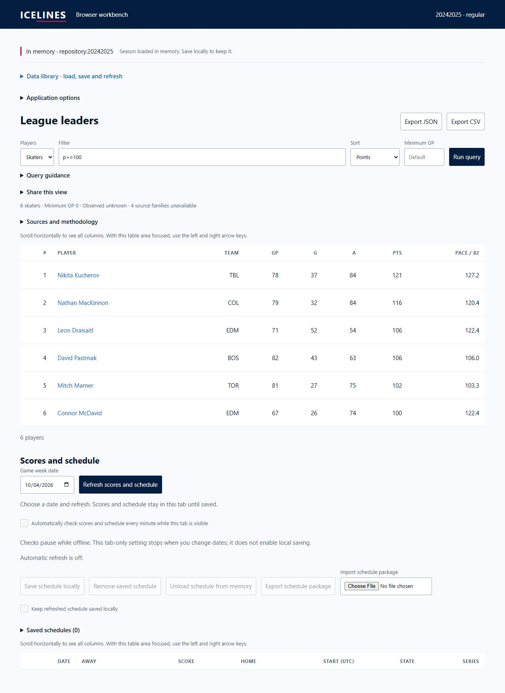

# Browser WASM pulse 37 — analysis-first composition

Date: 2026-10-04. REQ-BROWSER-001 / WP-BW-05. Previous turn made verified
handoff-review progress. Goal remains active.

Implemented CREST C1/C3's composition recommendation from the handoff review:
memory/source and action status remain in a compact summary, with Data Library
and application options in deliberate native details drilldowns. Query guidance
and source/methodology prose are expandable. Result count, GP floor, observation
time and missing-family count remain visible alongside the query/table. The
application-update notice remains outside the collapsed options. No source
disclosure or data control was removed.

Loading/selecting a season closes the library and focuses analysis when focus
was inside that panel. Startup restoration avoids stealing focus. The main
analysis heading is h1. Query/domain formulas and persistence behavior did not
change. Library failure retains the opened panel/recovery controls.

`npm test` rebuilt and passed **128** tests. Distribution verification passed
22 assets, 75 actual WASM packages, four count goldens and eight-window residency.
App plus largest package gzip: **404,795 bytes**. Final shell build:
`c6ecb4253273cb8b97a560f70359d68a6869dcd7ee12ea246461dba1eac3943a`.

Added a disposable composition preview copying production assets unchanged.
Actual final browser origin `http://127.0.0.1:8076/ICELINES/workbench/` and
a measured 360×800 iframe were used. Both loaded 2024–25 regular through the
visible Data Library, closed it automatically and focused analysis. `p>=100`
returned six shared-WASM rows. Methodology could be opened/read/closed. Narrow
document client/scroll widths both measured 345px (360px viewport with scrollbar).
ArrowRight moved the table; player Enter/Escape restored focus. This is local
browser/iframe evidence, not physical mobile or screen-reader acceptance.

Cold and ready screenshots were captured. A body Control+Home action timed out;
the focused-region variant did not return to page top. Documented native browser
scrolling then returned the narrow document to scrollY 0 for the verified ready
capture. Desktop uses a full-page capture to preserve top summary context.

Selected composition is improved; full cold/loading/stale/partial/unavailable/
unsaved state matrix and independent design acceptance remain open. Physical
mobile/resources, clean remote artifact, deployed/live/offline/update and remote
rollback still need evidence. Relay hosting stays deferred until deployed-origin
testing. No remote mutation ran.
