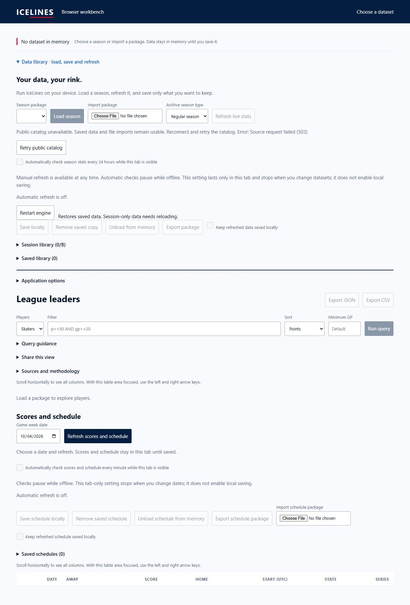
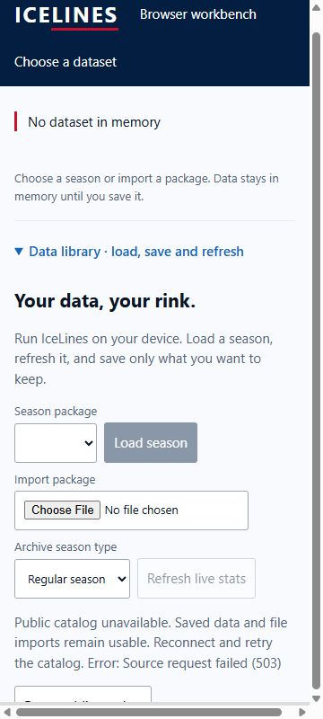

# Browser WASM pulse 47 — first remote artifact and failure composition

Date: 2026-10-04. Previous turn made progress with current-head clean artifact
verification. Goal remains active. Full native fetch test session 33174 exited 0;
all completed test binaries report success. Log remains
`target/browser-pulse-46-fetch-all.txt` in the managed worktree.

Remote browser run 37213784874 completed successfully for branch head aff632e1.
Its PR checkout source identity is GitHub merge commit
`2062dabb35f7aac699f66a7848afc0773d43236b`, not the branch head. Retained artifact
11307887532 was downloaded to managed worktree
`target/browser-remote-37213784874` and verified without executing its code:
102 files, 75 packages, clean source, pinned tool versions. Shell SHA-256:
`ae508e3d22088a0f4c324706f1c8f5cea599300617d537008285fb8d4e341f0b`.
WASM SHA-256:
`1344a015f6f61c6743185fabe92b37ecb39124f19826ab1d6fd4d55a7fdfe1f0`.
Linux and local Windows WASM bytes differ; each has its own integrity identity
and executed distributed-WASM validation. No cross-platform byte identity claim.
Current-head run 37214280596 still needs its own result/artifact verification.
This PR preview does not satisfy the master-only rollback workflow source gate.

Created disposable local state preview from unchanged clean current-head
production assets. Its first sandboxed listener was live but unreachable from
both shell and browser. The identified script process was stopped and relaunched
with approved network access; preview session 20305 serves port 8077. No automatic
approval rejection occurred. Script and preview directories are ignored target
artifacts, not production code.

Catalog-503 fixture showed a disabled Load season action, enabled local import,
and visible retry/recovery text. Desktop and measured 360x800 iframe screenshots
were saved. Narrow document client/scroll width both equal 345px, with no page
overflow. This is selected local failure composition, not mobile hardware,
screen-reader, live upstream or the full state matrix. The read-only top-level
iframe inspection was unavailable; frame-scoped DOM measurement succeeded.

Browser tabs 45 and 46 are marked for handoff this turn. Next action: revalidate
current-head CI and preview server, finish remaining state compositions using
visible controls, then review the complete acceptance evidence. No merge, Pages
settings or deployment occurred. Relay ownership remains deferred until deployed
origin testing. Deployed, device/resource and rollback gates remain open.
