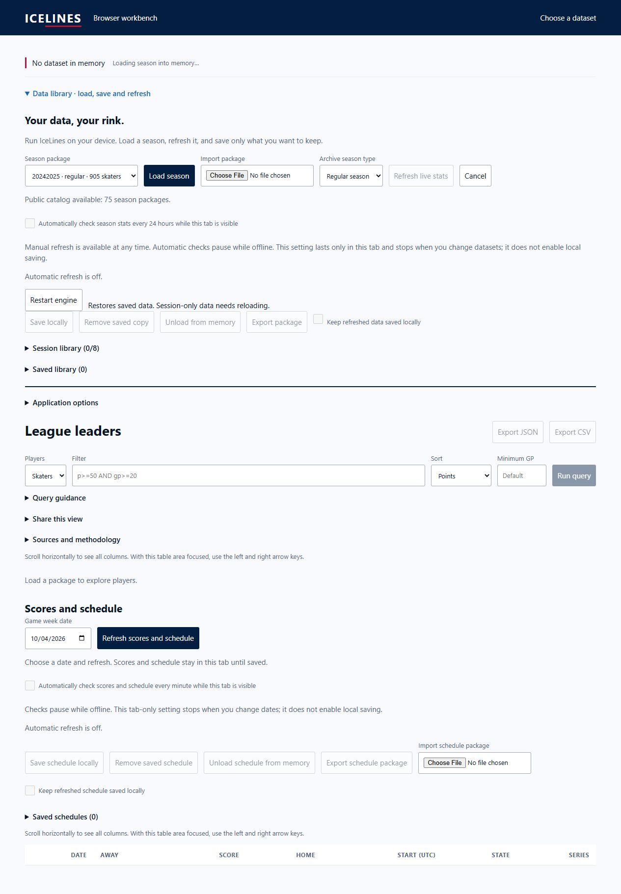
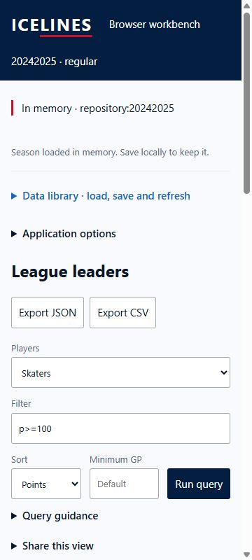

# Browser WASM pulse 48 — cold/loading/ready composition

Date: 2026-10-04. Previous turn made progress by verifying a successful remote
artifact and selected failure composition. Goal remains active. Revalidated
preview session 20305: still serving port 8077. Current-head browser run
37214280596 and repository matrix 37214280551 remained live, with no completed
failed matrix jobs at the final check. No current-head terminal result inferred.

The disposable delayed endpoint serves unchanged production assets from clean
head 79adf7e6 and delays package responses eight seconds. Desktop cold/loading
screens were captured via visible production controls. Loading displayed
`Loading season into memory…` and a visible Cancel action. Cancel showed recovery
instructions and kept `No dataset in memory`; after the delayed response arrived,
the cancelled request did not activate data. A subsequent load succeeded.

Ready state closes Data Library and shows `In memory · repository:20242025` plus
explicit save guidance. `p>=100` returns six actual shared-WASM rows. Query summary
discloses minimum GP 0, unknown observation time and four unavailable source
families. This is existing optional-family absence, not a fabricated partial
upstream refresh. No local save action was performed.

A separate measured 360x800 iframe completed cold/loading/ready. Document client
and scroll widths were both 345px during loading and ready. Screenshots captured
each state; native scrolling then exposed the compact memory/save summary for
the final narrow ready image. This proves selected local composition/containment,
not physical touch, screen reader or full stale-refresh state acceptance.

| State | Desktop | Narrow frame |
|---|---|---|
| Cold / no data | pulse-48-cold-desktop.png | pulse-48-cold-narrow.png |
| Package loading | pulse-48-loading-desktop.png | pulse-48-loading-narrow.png |
| Cancelled, no late activation | pulse-48-cancelled-desktop.png | Not repeated |
| Ready / unsaved / optional families unavailable | pulse-48-ready-unsaved-desktop.png | pulse-48-ready-unsaved-narrow.png |
| Catalog unavailable | Pulse 47 | Pulse 47 |
| Stale after failed refresh | Still open | Still open |

Tabs 47/48 are marked for handoff this turn. Earlier tabs 45/46 were not reused
and need not survive. Next action: inspect current-head remote results/artifact,
finish stale-refresh composition without substituting native request evidence,
and reconcile role findings with the expanded matrix. No merge/settings/deploy.
Physical device/full peak resources and deployed live/offline/update/rollback
gates remain open. Relay choice still follows deployed-origin testing.
