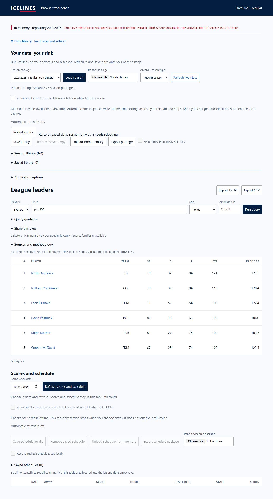

# Browser WASM pulse 50 — preserve live-refresh failure detail

Date: 2026-10-04. Previous turn made progress by verifying current-head remote
artifact identity. Goal remains active. Repository CI run 37214280551 remains
live with no completed failed jobs at final inspection.

Code inspection found the stats refresh catch handler aborted sibling requests
before checking `controller.signal.aborted`. Every source error consequently
looked like cancellation and lost retry details. It now captures pre-existing
cancellation before aborting remaining work. Context-change and user-cancel
handling remain distinct; prior active data is preserved. Only two lines in
production main.ts changed. Original and managed checkout contain this fix.

Terminal 19339 completed the full isolated checked build with exit 0: distributed
WASM verification, 270 native/WASM comparisons, affected Rust suites, 18 Python
tests and all 128 browser tests. Diff whitespace passed. Log:
`target/browser-pulse-50-failure-check.txt` in the managed worktree.

The service-worker network fixture in tab 50 still shows Refreshing NHL season
stats. No transport/stale-state proof is claimed. A separate labelled UI-boundary
fixture at `/failure-ui-50/` replaces only acquisition refreshStats with a thrown
503/retry-delay error. Production main/worker/WASM/CSS stay unchanged from the
new build. This exercises error orchestration/composition, not transport, retries,
offline shell or deployed live access. Modified fixture assets are never a
release artifact and their integrity manifest is not claimed valid.

Actual visible-control refresh in tab 51 showed:
`Live refresh failed. Your previous good data remains available.` plus the
121-second retry detail. All six rendered rows, the query observation/missing
family summary and memory/source state were equal before/after the failure.
No local save or persistence policy change occurred. Desktop screenshot captured.

Tabs 50/51 are marked for handoff. Server session 20305 serves port 8077.
Next action: commit/push the verified reporting fix and consolidated evidence,
finish network/narrow failure acceptance, and inspect terminal repository CI.
No merge, settings change or deployment. Full physical-device/resource and
deployed live/offline/update/rollback acceptance remain open.
