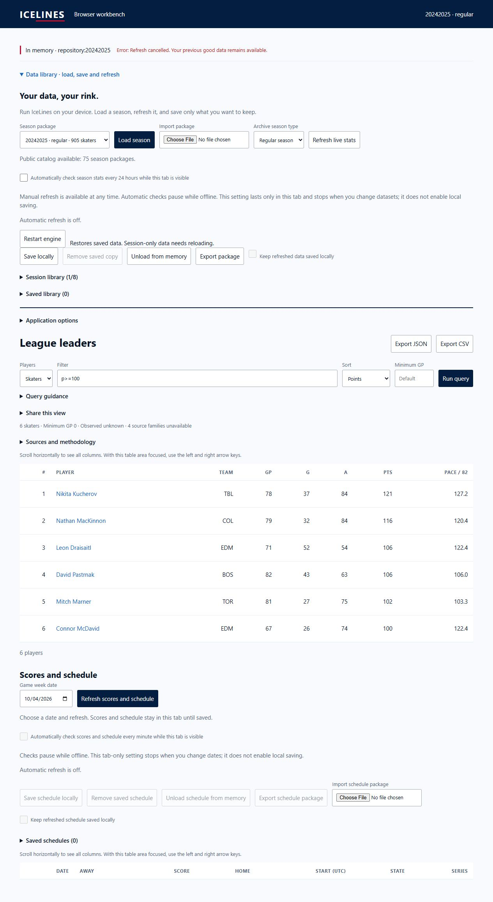

# Browser WASM pulse 51 — terminal cancellation status and green matrix

Date: 2026-10-04. Previous turn made progress with refresh error reporting.
Goal remains active. Reporting fix/evidence was committed and pushed as
`e404424d66f33a1ac054b409eb2960133e654eb0` to PR #74. Invalid fixture image was
excluded from the review bundle and preserved under ignored target storage.

Repository matrix 37214280551 completed successfully for 79adf7e6; all jobs passed.
Its browser artifact was already verified in pulse 49. These dated results do
not certify newer e404424d or pending changes. Browser run 37216141528 is live
for e404424d; inspect it and the new matrix rather than inferring green status.

The old network fixture's Refreshing text was misleading: Cancel was hidden and
the request had ended. Generic perform() suppressed every error containing
`cancelled`, including the terminal user cancellation message. This does not
prove a transport/deadline hang. Narrowed suppression to internal Error messages
starting `cancelled: `, preserving obsolete-context silence while displaying user
cancellation and arbitrary source failure detail. Main.ts only changes this
reporting boundary; production acquisition/formulas/persistence stay unchanged.

Terminal 18889 exited 0 for the full isolated checked build: distributed-WASM
checks, 270 native/WASM cases, affected Rust suites, 18 Python and 128 browser
tests. Log is `target/browser-pulse-51-cancel-check.txt` in managed worktree.

Separate labelled `/cancel-ui-51/` fixture replaces only acquisition refreshStats
with a promise awaiting signal abort. Real main/worker/WASM/CSS come from the new
build. It tests UI cancellation composition, not transport/offline/deployed access.
Tab 52 loaded six p>=100 rows. Visible Refresh then Cancel showed
`Refresh cancelled. Your previous good data remains available.`, hid Cancel,
re-enabled Refresh and preserved all six rendered rows. Screenshot captured.
The earlier network fixture remains unsuitable as HTTP-503 acceptance proof.

Tab 52 is marked for handoff this turn; earlier tabs were not re-marked. Server
20305 remains the disposable preview. Next action: commit/push verified generic
reporting correction, inspect fresh CI and complete narrow failure/cancellation
composition plus role-disposition reconciliation. No merge, settings or deploy.
Physical-device/full peak memory and deployed live/offline/update/rollback gates
remain open; relay host/owner still follows deployed-origin testing.
