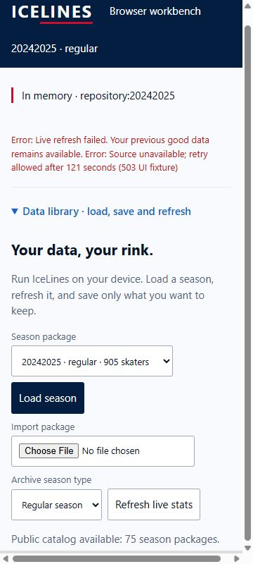
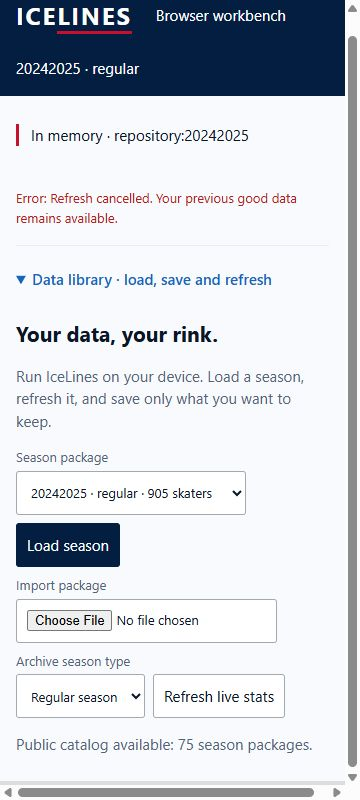

# Browser WASM pulse 52 — narrow failure/cancellation and role reconciliation

Date: 2026-10-04. Previous turn made progress with verified terminal cancellation
fix, pushed as `1b4e001315cccc38217f8160009b9bff32d49ce7`. Goal remains active.
Managed worktree was clean at initial inspection. Latest browser run 37216513390
is pending behind live e404424d run 37216141528. No latest-head result inferred.

Two labelled 360x800 iframe UI-boundary fixtures use current production main,
worker, WASM and CSS. Acquisition refreshStats is the only substituted boundary:
one throws the known 503/retry-delay error; the other waits for user abort.
These are composition/orchestration checks, not transport/deployed/offline proof.

Failure showed explicit live-refresh failure with 121-second retry detail and
preserved all six p>=100 rendered rows. Cancellation showed terminal recovery
text, hid Cancel, re-enabled Refresh and preserved rows. Both measured document
client/scroll width 345px. Native scrolling exposed summary/error text for the
captures. No local save action or policy change occurred. No physical-device or
screen-reader acceptance inferred.

Reconciled all 18 original role findings in the handoff review without rewriting
historical counts. K1/K2/B2 amended; C1/C3 implemented locally; F1/C2 partially
resolved; six release-gate groups remain open. Five P3 constraints are retained.
Release verdict remains NEEDS-WORK. Clean remote PR artifact and green historical
matrix do not approve a latest master release/rollback artifact or deployment.

Tabs 53/54 are marked for handoff this turn. Server session 20305 serves 8077.
Next action: inspect latest CI, verify latest retained artifact and consolidate
role dispositions/evidence into the PR. Complete missing timestamp/source-state
and representative-resource evidence before closing their gates. No merge,
settings migration or deployment. Relay choice follows deployed-origin testing.
