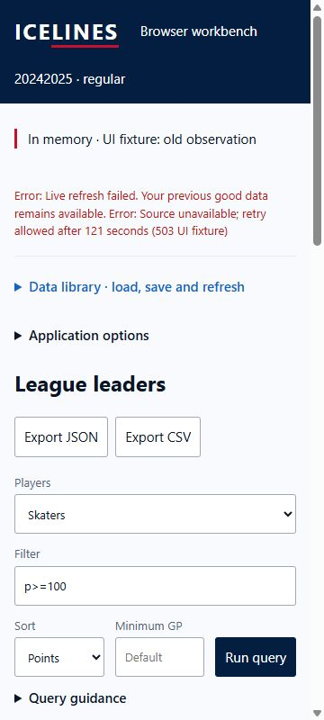
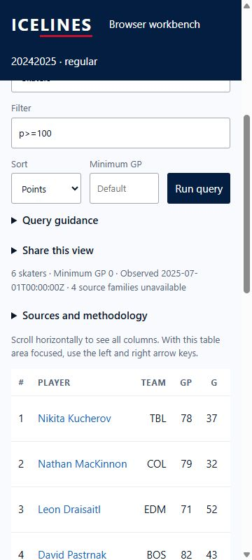

# Browser WASM pulse 53 — dated imported observation preserved

Date: 2026-10-04. Previous turn made progress with narrow error/cancellation
composition and all-role disposition reconciliation. Goal remains active.

Created a labelled old-observation package from the public 2024–25 regular
fixture, changing only source/observation/fetch metadata. It is not real upstream
observation evidence: source explicitly says UI fixture; observed July 1, 2025
and fetched July 2, 2025. Actual 908,887-byte JSON was selected through the browser
file chooser into the production import handler in narrow tab 53. The tool took
73 seconds despite its requested timeout; this is not an import-cost benchmark.

Import displayed `In memory · UI fixture: old observation`. The saved count
remained zero. Query p>=100 returned six shared-WASM rows, with the exact old
observation and four unavailable source families visible in query summary.
Visible Refresh used the labelled acquisition UI-boundary failure fixture and
showed retry detail. All six rows and the exact observation summary were equal
before/after failure; the import was not silently saved or stamped fresh.
No transport/deployed access/offline/memory proof is inferred from this fixture.

Document client/scroll widths remained 345px in the 360x800 frame. Captured the
error/context and retained-observation views separately so both can be read.
The timestamp wraps without page overflow. Actual file hash and observation scope
are recorded in [dated evidence](browser-pulse-53-dated-observation.json).

Latest browser run 37216513390 remains live. Repository run 37216513417 had no
completed failures and only release CLI, Windows package and cli-art-ross jobs
active at final inspection. No latest-head success/artifact inferred. Tab 53 is
marked for handoff; preview server is session 20305. Next action: complete desktop
dated-source evidence and inspect terminal latest CI/artifact, then consolidate
review evidence without closing physical-device/resource or deployed gates.
No merge, settings migration or deployment occurred. Relay selection remains
after deployed-origin testing.
