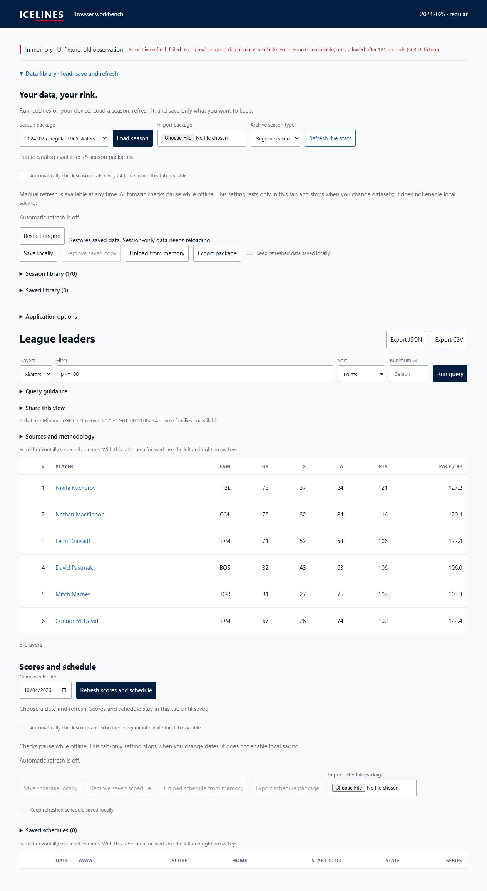

# Browser WASM pulse 54 — latest CI green and dated desktop preservation

Date: 2026-10-04. Goal remains active; relay selection remains deferred until
deployed-origin testing, as requested by the user.

The actual file chooser imported the labelled old-observation fixture into the
desktop production import handler. Refresh used only the explicitly substituted
acquisition UI boundary; it was not a real HTTP failure or deployed-origin test.
All six filtered rows remained byte-for-byte equal in rendered table text, the
summary retained `Observed 2025-07-01T00:00:00Z`, and Saved library remained zero.
The source still identified the dated UI fixture and the status retained the
503/121-second retry detail. No data was saved and no fixture entered release assets.

Both latest-head runs completed successfully for
`1b4e001315cccc38217f8160009b9bff32d49ce7`:

- [Browser build](https://github.com/giodl73-repo/ICELINES/actions/runs/37216513390)
- [Repository matrix](https://github.com/giodl73-repo/ICELINES/actions/runs/37216513417)

Downloaded retained artifact 11309002803 into the isolated worktree at
`target/browser-remote-37216513390`. The verifier checked 102 files and 75 packages
without executing artifact code. Its clean source is the GitHub PR merge commit
`fb4b6bf5c3250fa1e0a8d7ab9d6222e4eb1378fb`, not the branch head. Shell SHA-256:
`b9e5bde722afcc98187fb110b45e7e1c17ddf6ccc07c70d1f70c92a6806af315`.
WASM SHA-256:
`1344a015f6f61c6743185fabe92b37ecb39124f19826ab1d6fd4d55a7fdfe1f0`.
Pinned Rust/Node/Python/wasm-bindgen versions match the configured build.

This closes the latest implementation checkpoint's remote CI/artifact uncertainty.
It does not supply a reviewed master deployment/rollback artifact, exact-origin
live stats/schedule access, physical mobile/assistive acceptance, or full transient
peak-memory measurements. The six-role release verdict remains NEEDS-WORK.
No merge, Pages settings migration or deployment occurred. A physical mobile
device preference was requested; no answer was available when this record was written.
