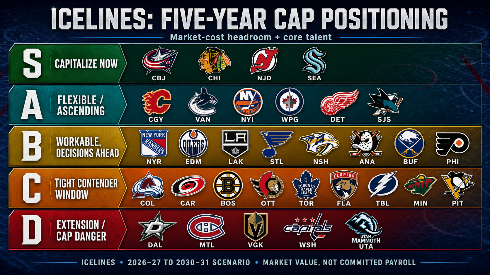
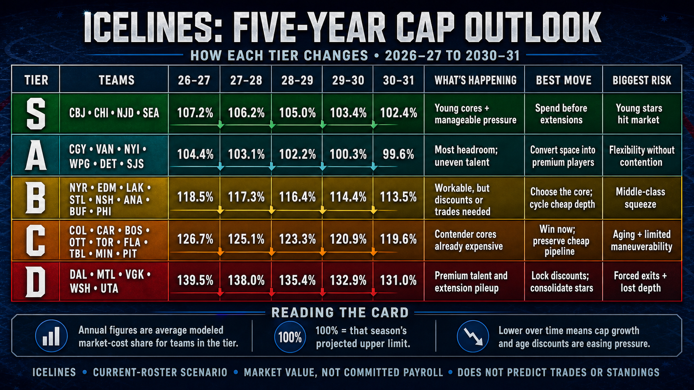

# Generated decision reports

This directory holds dated, reviewable outputs from ICELINES durable report
commands. Each report must preserve its schema/methodology disclosures and keep
confirmed source values distinct from modeled scenarios.

## 2026-27 preseason

- [Division forecast](2026-08-06-preseason-division-forecast.md)

## Five-year cap positioning

- [League market-cost forecast](2026-07-15-cap-forecast-league.txt)
- [Shareable five-year positioning tier card](2026-07-15-cap-positioning-tier-card.png)
- [Five-year tier outlook grid (card back)](2026-07-15-cap-positioning-tier-card-back.png)

The tier card combines modeled market-cost headroom with the age and quality of
each current roster's core. It is an editorial interpretation of the forecast,
not a ranking of actual committed payroll or a prediction of standings.

